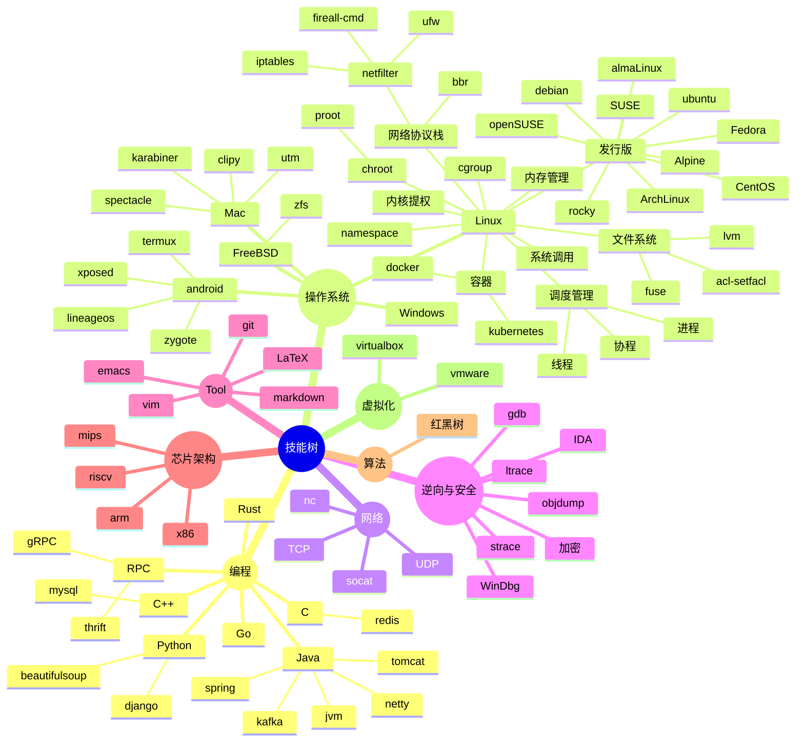

# My Mind Map

```mermaid
mindmap
  root((技能树))
    sub-branch1((编程))
      C
        redis
      C++
        mysql
      Go
      Rust
      Java
        jvm
        tomcat
        spring
        netty
        kafka
      Python
        django
        beautifulsoup
      RPC
        thrift
        gRPC
    sub-branch2((操作系统))
      Linux
        调度管理
          进程
          线程
          协程
        内存管理
        网络协议栈
          bbr
          netfilter
            iptables
            fireall-cmd
            ufw
        文件系统
          lvm
          fuse
          acl-setfacl
        内核提权
        系统调用
        容器
          docker
          kubernetes
        chroot
          proot
        namespace
        cgroup
        发行版
          debian
          ubuntu
          SUSE
          Fedora
          openSUSE
          CentOS
          ArchLinux
          Alpine
          rocky
          almaLinux
      Mac
        utm
        karabiner
        clipy
        spectacle
      FreeBSD
        zfs
      Windows
      android
        termux
        xposed
        lineageos
        zygote
    sub-branch3((网络))
      TCP
      UDP
      socat
      nc
    sub-branch4((逆向与安全))
      加密
      IDA
      WinDbg
      objdump
      gdb
      strace
      ltrace
    sub-branch5((Tool))
      git
      markdown
      LaTeX
      vim
      emacs
    sub-branch6((芯片架构))
      x86
      arm
      riscv
      mips
    sub-branch7((算法))
      红黑树
    sub-branch8((虚拟化))
      vmware
      virtualbox


```